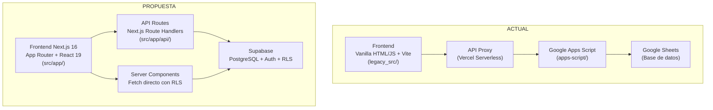

# Migración Completa: Next.js 16 + Supabase + Seguridad Integral

Migración del e-commerce **Limpieza RR** desde la arquitectura actual (Google Apps Script + Google Sheets + Vite legacy) hacia un stack moderno con Next.js 16 App Router, Supabase (PostgreSQL con RLS), y múltiples capas de seguridad.

---

## User Review Required

> [!IMPORTANT]
> **Credenciales de Supabase**: Necesito que crees un proyecto en [supabase.com](https://supabase.com) y me proporciones:
> - `SUPABASE_URL` (URL de tu proyecto)
> - `SUPABASE_ANON_KEY` (clave pública/anon)
> - `SUPABASE_SERVICE_ROLE_KEY` (clave de servicio, solo para backend)
>
> Sin estas credenciales, puedo crear toda la estructura del código pero no podré probar la conexión real a la base de datos.

> [!WARNING]
> **Migración de datos**: Los datos actuales viven en Google Sheets. La migración requiere un script de exportación → importación. Durante la migración habrá un período donde Google Sheets sigue siendo la fuente de verdad hasta que validemos Supabase. Se recomienda hacer un backup previo con `hacerBackup()` en Apps Script.

> [!IMPORTANT]
> **Dominio y CORS**: Necesito confirmar los dominios exactos de producción para configurar CORS:
> - ¿El dominio es `limpiezarr.com`? 
> - ¿Hay algún subdominio adicional (ej: `admin.limpiezarr.com`)?
> - ¿Desplegado en Vercel?

---

## Arquitectura Actual vs. Propuesta



---

## Proposed Changes

### Fase 1: Infraestructura Base y Seguridad (Prioridad Alta)

#### 1.1 — Configuración del Proyecto Next.js

##### [MODIFY] [next.config.ts](file:///d:/Empresa%20Limpieza%20RR%20V2.0.0.1/limpieza-rr-v2/next.config.ts)
- Configurar security headers completos (CSP, X-Frame-Options, HSTS, etc.)
- Configurar `images.remotePatterns` para Google Drive y Supabase Storage
- Configurar CORS restrictivo vía headers
- Configurar Subresource Integrity (SRI) experimental
- Configurar redirects de URLs legacy
- Eliminar referencia a framework Vite en vercel.json

##### [MODIFY] [package.json](file:///d:/Empresa%20Limpieza%20RR%20V2.0.0.1/limpieza-rr-v2/package.json)
- Agregar dependencias: `@supabase/supabase-js`, `@supabase/ssr`, `zod`, `jose`, `server-only`, `bcryptjs`
- Agregar `@next/third-parties` para Google Analytics
- Actualizar nombre del proyecto a `limpieza-rr`
- Agregar scripts de migración

##### [NEW] .env.local (actualización)
- Agregar variables de Supabase: `SUPABASE_URL`, `SUPABASE_ANON_KEY`, `SUPABASE_SERVICE_ROLE_KEY`
- Renombrar variables `VITE_*` → `NEXT_PUBLIC_*` y server-side sin prefijo
- Agregar `SESSION_SECRET` para JWT del admin
- Agregar `ALLOWED_ORIGINS` para CORS

##### [MODIFY] [vercel.json](file:///d:/Empresa%20Limpieza%20RR%20V2.0.0.1/limpieza-rr-v2/vercel.json)
- Eliminar configuración de Vite (`framework: "vite"`, `outputDirectory: "dist"`)
- Next.js se auto-detecta en Vercel, así que solo conservar headers especiales

---

#### 1.2 — Seguridad: Middleware, CSP y Security Headers

##### [NEW] src/middleware.ts
- Middleware de Next.js para:
  - **CORS enforcement**: Validar `Origin` header contra whitelist de dominios permitidos
  - **CSP headers**: Inyectar Content-Security-Policy con nonces dinámicos
  - **Rate limiting** básico con headers
  - **Security headers**: X-Content-Type-Options, X-Frame-Options, Referrer-Policy, Permissions-Policy, Strict-Transport-Security
  - **Protección de rutas admin**: Validar JWT session cookie en rutas `/admin/*` y `/api/admin/*`
  - Matcher para excluir assets estáticos

##### [NEW] src/lib/security/cors.ts
- Módulo de validación CORS
- Whitelist de orígenes permitidos (tu dominio de producción + localhost en dev)
- Helper `validateOrigin(origin: string): boolean`
- Helper `corsHeaders(origin: string): HeadersInit`

##### [NEW] src/lib/security/headers.ts
- Función para generar todos los security headers
- CSP policy builder configurable
- Soporte para nonces en scripts de terceros (Google Analytics)

---

#### 1.3 — Supabase: Configuración y Schema

##### [NEW] src/lib/supabase/client.ts
- Cliente Supabase para el **browser** (anon key, para componentes client)
- Usa `createBrowserClient` de `@supabase/ssr`

##### [NEW] src/lib/supabase/server.ts
- Cliente Supabase para **Server Components** y **Route Handlers**
- Usa `createServerClient` de `@supabase/ssr` con cookies
- Maneja la clave `service_role` solo en server

##### [NEW] src/lib/supabase/admin.ts
- Cliente Supabase con `service_role` key para operaciones administrativas
- Importa `server-only` para prevenir uso en client
- Usado solo en Route Handlers de admin y Server Actions

##### [NEW] supabase/migrations/001_initial_schema.sql
Creación de todas las tablas en PostgreSQL siguiendo el SCHEMA.md actual:

```sql
-- Productos
CREATE TABLE productos (
  id TEXT PRIMARY KEY DEFAULT 'P-' || upper(substr(md5(random()::text), 1, 7)),
  nombre TEXT NOT NULL,
  tamano TEXT,
  precio NUMERIC NOT NULL DEFAULT 0,
  costo NUMERIC DEFAULT 0,
  categoria TEXT,
  destacado BOOLEAN DEFAULT false,
  emoji TEXT,
  descripcion TEXT,
  imagen TEXT,
  imagen2 TEXT,
  imagen3 TEXT,
  stock INTEGER,
  created_at TIMESTAMPTZ DEFAULT now(),
  updated_at TIMESTAMPTZ DEFAULT now()
);

-- Pedidos
CREATE TABLE pedidos (
  id SERIAL PRIMARY KEY,
  fecha TIMESTAMPTZ DEFAULT now(),
  nombre TEXT NOT NULL,
  telefono TEXT NOT NULL,
  ciudad TEXT,
  departamento TEXT,
  barrio TEXT,
  direccion TEXT,
  casa TEXT,
  conjunto TEXT,
  nota TEXT,
  cupon TEXT,
  descuento NUMERIC DEFAULT 0,
  pago TEXT,
  zona_envio TEXT,
  costo_envio NUMERIC DEFAULT 0,
  subtotal NUMERIC DEFAULT 0,
  total NUMERIC DEFAULT 0,
  estado_pago TEXT DEFAULT 'PENDIENTE',
  estado_envio TEXT DEFAULT 'Recibido',
  productos TEXT,
  productos_json JSONB,
  archivado BOOLEAN DEFAULT false,
  created_at TIMESTAMPTZ DEFAULT now(),
  updated_at TIMESTAMPTZ DEFAULT now()
);

-- Clientes
CREATE TABLE clientes (
  id SERIAL PRIMARY KEY,
  nombre TEXT,
  telefono TEXT UNIQUE NOT NULL,
  ciudad TEXT,
  barrio TEXT,
  direccion TEXT,
  primera_compra TIMESTAMPTZ,
  ultima_compra TIMESTAMPTZ,
  total_pedidos INTEGER DEFAULT 0,
  total_gastado NUMERIC DEFAULT 0,
  tipo TEXT DEFAULT 'Nuevo',
  created_at TIMESTAMPTZ DEFAULT now()
);

-- Cupones
CREATE TABLE cupones (
  id SERIAL PRIMARY KEY,
  codigo TEXT UNIQUE NOT NULL,
  descripcion TEXT,
  tipo TEXT CHECK (tipo IN ('PORCENTAJE', 'VALOR_FIJO')),
  valor NUMERIC NOT NULL,
  usos_maximos INTEGER,
  usos_actuales INTEGER DEFAULT 0,
  vencimiento DATE,
  activo BOOLEAN DEFAULT true
);

-- Calificaciones
CREATE TABLE calificaciones (
  id SERIAL PRIMARY KEY,
  telefono TEXT,
  estrellas INTEGER CHECK (estrellas BETWEEN 1 AND 5),
  comentario TEXT,
  created_at TIMESTAMPTZ DEFAULT now()
);

-- Proveedores
CREATE TABLE proveedores (
  id SERIAL PRIMARY KEY,
  nombre TEXT NOT NULL,
  contacto TEXT,
  telefono TEXT,
  email TEXT,
  productos TEXT[],
  estado TEXT DEFAULT 'activo',
  notas TEXT,
  created_at TIMESTAMPTZ DEFAULT now()
);

-- Admin users (para autenticación del panel)
CREATE TABLE admin_users (
  id UUID PRIMARY KEY DEFAULT gen_random_uuid(),
  email TEXT UNIQUE,
  password_hash TEXT NOT NULL,
  role TEXT DEFAULT 'admin',
  created_at TIMESTAMPTZ DEFAULT now()
);
```

##### [NEW] supabase/migrations/002_rls_policies.sql
Row Level Security — solo se expone lo que se debe exponer:

```sql
-- ═══ PRODUCTOS ═══
ALTER TABLE productos ENABLE ROW LEVEL SECURITY;

-- Público: cualquiera puede leer productos
CREATE POLICY "productos_public_read" ON productos
  FOR SELECT USING (true);

-- Solo admin autenticado puede modificar
CREATE POLICY "productos_admin_write" ON productos
  FOR ALL USING (
    auth.role() = 'service_role' 
    OR (auth.jwt() ->> 'role') = 'admin'
  );

-- ═══ PEDIDOS ═══
ALTER TABLE pedidos ENABLE ROW LEVEL SECURITY;

-- Público: puede insertar pedidos (crear pedido desde tienda)
CREATE POLICY "pedidos_public_insert" ON pedidos
  FOR INSERT WITH CHECK (true);

-- Público: puede leer SUS pedidos por teléfono
CREATE POLICY "pedidos_public_read_own" ON pedidos
  FOR SELECT USING (
    telefono = current_setting('request.jwt.claims', true)::json ->> 'telefono'
    OR auth.role() = 'service_role'
    OR (auth.jwt() ->> 'role') = 'admin'
  );

-- Admin: lectura y escritura completa
CREATE POLICY "pedidos_admin_all" ON pedidos
  FOR ALL USING (
    auth.role() = 'service_role'
    OR (auth.jwt() ->> 'role') = 'admin'
  );

-- ═══ CLIENTES ═══
ALTER TABLE clientes ENABLE ROW LEVEL SECURITY;

CREATE POLICY "clientes_admin_only" ON clientes
  FOR ALL USING (
    auth.role() = 'service_role'
    OR (auth.jwt() ->> 'role') = 'admin'
  );

-- ═══ CUPONES ═══
ALTER TABLE cupones ENABLE ROW LEVEL SECURITY;

-- Público: leer cupones activos (para validar en checkout)
CREATE POLICY "cupones_public_read_active" ON cupones
  FOR SELECT USING (activo = true);

-- Admin: todo
CREATE POLICY "cupones_admin_all" ON cupones
  FOR ALL USING (
    auth.role() = 'service_role'
    OR (auth.jwt() ->> 'role') = 'admin'
  );

-- ═══ CALIFICACIONES ═══
ALTER TABLE calificaciones ENABLE ROW LEVEL SECURITY;

CREATE POLICY "calificaciones_public_insert" ON calificaciones
  FOR INSERT WITH CHECK (true);

CREATE POLICY "calificaciones_public_read" ON calificaciones
  FOR SELECT USING (true);

-- ═══ PROVEEDORES ═══
ALTER TABLE proveedores ENABLE ROW LEVEL SECURITY;

CREATE POLICY "proveedores_admin_only" ON proveedores
  FOR ALL USING (
    auth.role() = 'service_role'
    OR (auth.jwt() ->> 'role') = 'admin'
  );

-- ═══ ADMIN_USERS ═══
ALTER TABLE admin_users ENABLE ROW LEVEL SECURITY;

CREATE POLICY "admin_users_service_only" ON admin_users
  FOR ALL USING (auth.role() = 'service_role');
```

---

### Fase 2: Autenticación del Admin + API Routes

#### 2.1 — Sistema de Auth del Admin

##### [NEW] src/lib/auth/session.ts
- Encrypt/Decrypt sessions con JWT (usando `jose`)
- Cookie management con `next/headers` cookies API
- `createAdminSession()`, `validateAdminSession()`, `deleteAdminSession()`
- HttpOnly, Secure, SameSite cookies

##### [NEW] src/app/api/auth/login/route.ts
- POST handler para login del admin
- Valida credenciales contra tabla `admin_users` en Supabase
- Crea session JWT y setea cookie HttpOnly
- CORS headers restrictivos

##### [NEW] src/app/api/auth/logout/route.ts
- POST handler para logout del admin
- Elimina session cookie

#### 2.2 — API Route Handlers (reemplazando api/proxy.js)

##### [NEW] src/app/api/productos/route.ts
- GET: Fetch productos con Supabase client (público, cacheado)
- POST: CRUD de productos (solo admin, validar sesión)
- CORS headers en cada response

##### [NEW] src/app/api/pedidos/route.ts
- GET: Admin obtiene todos los pedidos
- POST: Crear nuevo pedido (público), actualizar estados (admin)
- Validación con Zod schemas
- Auto-upsert de cliente al crear pedido

##### [NEW] src/app/api/pedidos/[id]/route.ts
- GET: Detalles de un pedido
- PATCH: Modificar pedido (admin)
- DELETE: Archivar pedido (admin)

##### [NEW] src/app/api/historial/route.ts
- GET: Historial de pedidos por teléfono (público)

##### [NEW] src/app/api/estado/route.ts
- GET: Estado de pedido por teléfono (público)

##### [NEW] src/app/api/cupones/route.ts
- GET: Validar cupón por código (público)
- POST/PATCH: CRUD de cupones (admin)

##### [NEW] src/app/api/resenas/route.ts
- GET: Obtener reseñas (público)
- POST: Enviar calificación (público)

##### [NEW] src/app/api/dashboard/route.ts
- GET: Métricas del dashboard (admin)
- Calcula KPIs desde Supabase con aggregations

##### [NEW] src/app/api/clientes/route.ts
- GET: Listar clientes (admin)
- POST: Upsert cliente (admin)

##### [NEW] src/app/api/proveedores/route.ts
- GET: Listar proveedores (admin)
- POST: Upsert proveedor (admin)

##### [NEW] src/lib/validators/schemas.ts
- Zod schemas para validar:
  - `PedidoSchema` — datos del pedido
  - `ProductoSchema` — datos del producto
  - `CuponSchema` — datos del cupón
  - `LoginSchema` — credenciales
  - Sanitización de inputs

---

### Fase 3: Frontend — Tienda Pública (Next.js App Router)

#### 3.1 — Layout y Componentes Compartidos

##### [MODIFY] src/app/layout.tsx
- Metadata SEO completa (título, descripción, OpenGraph, Twitter cards, Schema.org)
- Google Fonts: Bricolage Grotesque + Plus Jakarta Sans
- ThemeProvider (dark/light mode)
- Google Analytics con nonce CSP
- PWA manifest
- Importar CSS global (no Tailwind, Vanilla CSS)

##### [NEW] src/app/globals.css
- Design tokens (colores, tipografía, spacing, shadows, border-radius)
- Reset CSS
- Scrollbar personalizada
- Keyframe animations (fadeUp, shimmer, pulse, float)
- Responsive breakpoints
- Dark mode support con `data-theme`

##### [NEW] src/components/ui/Nav.tsx (Client Component)
- Navegación responsive con hamburger menu
- Logo, enlaces, WhatsApp CTA, carrito badge, theme toggle
- Scroll-aware sticky behavior

##### [NEW] src/components/ui/Footer.tsx
- Footer con brand, navegación, contacto, badges
- Links a WhatsApp, teléfono

##### [NEW] src/components/ui/Toast.tsx (Client Component)
- Sistema de notificaciones toast

##### [NEW] src/components/ui/ThemeProvider.tsx (Client Component)
- Context provider para dark/light mode
- Persiste en localStorage
- Anti-flash script

#### 3.2 — Páginas de la Tienda

##### [MODIFY] src/app/page.tsx
- **Server Component** que fetchea productos desde Supabase
- Secciones: Hero, Benefits, Productos, Reseñas, Contacto
- Pasa datos a componentes client interactivos

##### [NEW] src/components/store/Hero.tsx
- Sección hero con stats dinámicos y carousel de productos destacados

##### [NEW] src/components/store/Carousel.tsx (Client Component)
- Carousel de productos destacados con auto-play y controles

##### [NEW] src/components/store/ProductGrid.tsx (Client Component)
- Grid de productos con search, filtro por categoría
- Skeleton loading states
- Click → modal de detalle

##### [NEW] src/components/store/ProductModal.tsx (Client Component)
- Modal de detalle de producto con galería de imágenes
- Selector de cantidad, agregar al carrito

##### [NEW] src/components/store/Cart.tsx (Client Component)
- Sidebar del carrito
- Aplicar cupón, calcular totales
- Botón de "Realizar pedido"

##### [NEW] src/components/store/OrderForm.tsx (Client Component)
- Formulario de datos de entrega
- Validación con Zod en client y server
- Zonas de envío
- Métodos de pago
- Confirmar pedido → envía a Supabase + abre WhatsApp

##### [NEW] src/components/store/Reviews.tsx (Client Component)
- Mostrar reseñas y puntuación promedio
- Formulario de calificación

##### [NEW] src/components/store/Benefits.tsx
- Sección "¿Por qué somos premium?" con cards animadas

##### [NEW] src/lib/store/cart-store.ts
- Estado del carrito con React Context o zustand
- Persistencia en localStorage

##### [NEW] src/lib/store/api-client.ts
- Funciones typed para fetch desde el client al API
- `fetchProductos()`, `fetchCupon()`, `postPedido()`, etc.
- Siempre usa `/api/...` (mismo origen → sin problemas CORS)

---

### Fase 4: Frontend — Panel de Administración

##### [NEW] src/app/admin/layout.tsx
- Layout del admin con verificación de sesión (Server Component)
- Redirect a login si no hay sesión
- Header con logo, refresh, logout, theme toggle

##### [NEW] src/app/admin/page.tsx
- Redirect al dashboard o login

##### [NEW] src/app/admin/login/page.tsx
- Página de login del admin (glassmorphism design)
- Server Action para autenticar

##### [NEW] src/app/admin/pedidos/page.tsx
- Panel de pedidos con filtros, paginación
- Acciones: cambiar estado, archivar, modificar, cancelar

##### [NEW] src/app/admin/inventario/page.tsx
- Gestión de inventario, stock, precios, costos

##### [NEW] src/app/admin/clientes/page.tsx
- Lista de clientes con filtros por tipo (VIP, Recurrente, Nuevo)

##### [NEW] src/app/admin/proveedores/page.tsx
- Gestión de proveedores

##### [NEW] src/app/admin/dashboard/page.tsx
- Dashboard con KPIs: ventas hoy/mes, ticket promedio, top productos
- Charts de ventas por semana

##### [NEW] src/app/admin/rentabilidad/page.tsx
- Análisis de rentabilidad por producto y categoría
- Calculadora de precios

---

### Fase 5: Migración de Datos y Limpieza

##### [NEW] scripts/migrate-from-sheets.ts
- Script para exportar datos de Google Sheets → JSON
- Script para importar JSON → Supabase
- Mapeo de columnas legacy → columnas PostgreSQL
- Validación de integridad post-migración

##### [DELETE] api/proxy.js, api/auth.js, api/logout.js
- Eliminados — reemplazados por Route Handlers en `src/app/api/`

##### [MODIFY] vercel.json
- Limpiar config Vite → Next.js auto-config

---

## Resumen de Seguridad Implementada

| Capa | Implementación |
|------|---------------|
| **CORS** | Middleware valida `Origin` contra whitelist (`limpiezarr.com`, localhost en dev). API Routes devuelven headers CORS restrictivos. |
| **CSP** | Content-Security-Policy via `next.config.ts` headers. Permite self + Google Fonts + Google Analytics + Supabase. |
| **RLS** | Row Level Security en Supabase: público lee productos/cupones, solo admin escribe. Pedidos filtrados por teléfono. |
| **Auth** | JWT sessions con `jose`, cookies HttpOnly + Secure + SameSite=Strict. Password hashing con bcrypt. |
| **Headers** | X-Content-Type-Options: nosniff, X-Frame-Options: DENY, HSTS, Referrer-Policy: strict-origin-when-cross-origin, Permissions-Policy restrictiva. |
| **Validación** | Zod schemas en Server Actions y Route Handlers. Sanitización de inputs. |
| **Envs** | Server-only keys sin prefijo `NEXT_PUBLIC_`. Solo `SUPABASE_ANON_KEY` expuesto al client. |
| **SRI** | Subresource Integrity experimental para scripts estáticos. |

---

## Open Questions

> [!IMPORTANT]
> 1. **¿Ya tienes un proyecto Supabase creado?** Necesito las credenciales para configurar la conexión.
> 2. **¿Cuál es tu dominio de producción exacto?** (`limpiezarr.com` o `www.limpiezarr.com` o ambos?)
> 3. **¿Quieres mantener Google Sheets como fallback temporal** durante la migración, o prefieres cortar directamente a Supabase?
> 4. **¿Quieres migrar las imágenes de Google Drive a Supabase Storage**, o mantener los enlaces de Drive por ahora?
> 5. **¿La contraseña del admin actual (`L1mp13z4RR2026`) debe cambiar?** Recomiendo fuertemente usar bcrypt hash en Supabase.

---

## Verification Plan

### Automated Tests
1. Verificar que `npm run build` compila sin errores
2. Verificar que `npm run dev` arranca correctamente
3. Navegar con el browser subagent:
   - Página principal carga productos
   - Carrito funciona (agregar, remover, cupón)
   - Formulario de pedido envía correctamente
   - Panel admin: login, ver pedidos, cambiar estados
4. Verificar security headers en respuestas HTTP
5. Verificar que API routes protegidas devuelven 401 sin sesión

### Manual Verification
- Verificar en Supabase Dashboard que las RLS policies funcionan
- Probar desde herramientas como `curl` que CORS bloquea orígenes no autorizados
- Verificar que las variables de entorno server-only no se exponen en el bundle client
